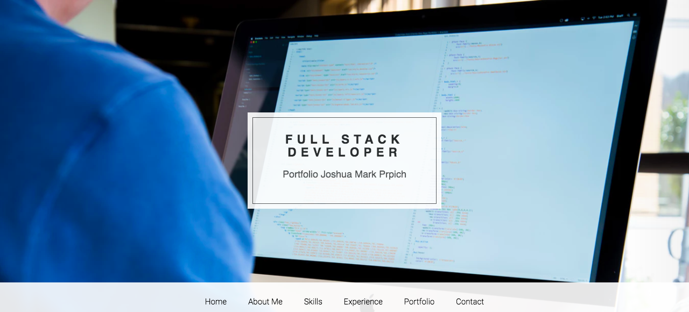
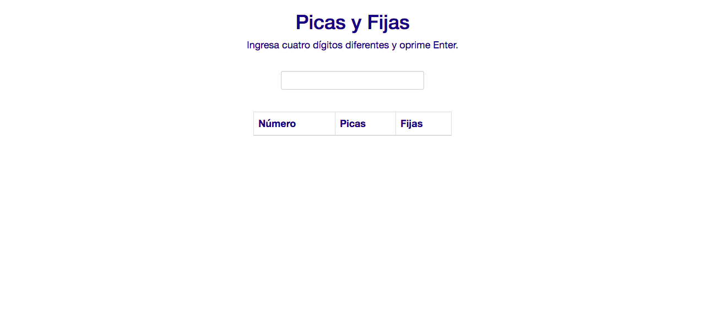
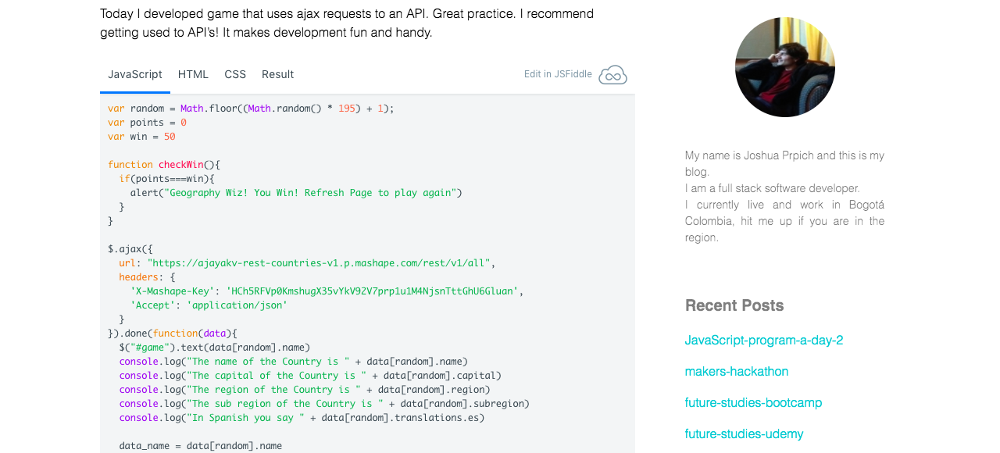
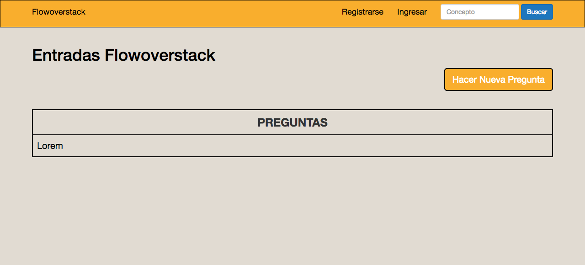
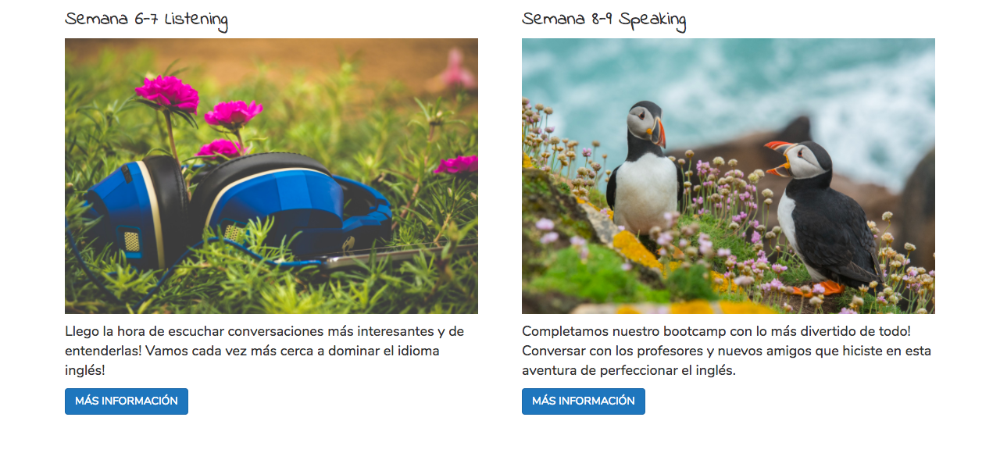
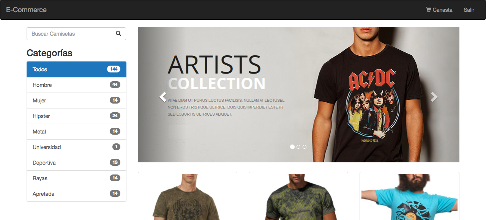
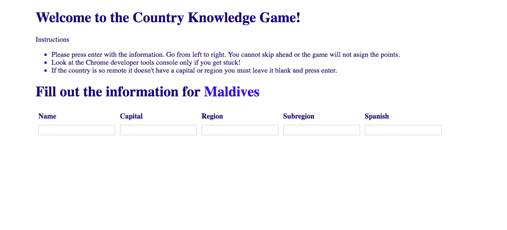
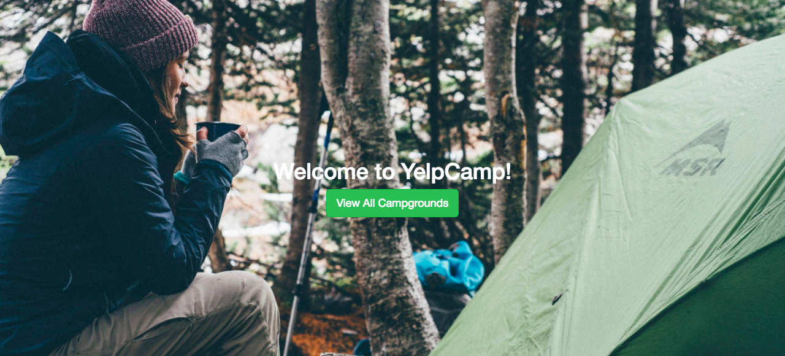

  

    

      
      

        <h3>Portfolio Joshua Mark Prpich</h3>
        
My personal portfolio designed using Hexo. Basic Usage of Writing, Front-Matter, Tag Plugins, Asset Folders, and Deployment.

        <a href="https://jprpich.github.io/portfolio" target="_blank">Go To Home Page</a>
      

    

  

  

    

      
      

        <h3>Picas y Fijas</h3>
        
A Number Guessing Education Game made with HTML5, CSS3, Bootstrap, JavaScript, jQuery, and AJAX

        <a href="https://jprpich.github.io/picas-y-fijas/" target="_blank">Go To Project</a>
      

    

  

  

    

      
      

        <h3>Hexo Coding Blog</h3>
        
My personal coding and personal development blog developed using hexo. Javascript and Ruby programs explained in the blog.

        <a href="https://jprpich.github.io/personal-development-blog/" target="_blank">Go To Coding Blog</a>
      

    

  

  

    

      
      

        <h3>Flow Overstack</h3>
        
A Stack Overflow Clone using polymorphic associations, many to many associations, and ruby on rails.

        <a href="https://desolate-bayou-66941.herokuapp.com/" target="_blank">Go To Project</a>
      

    

  

  

    

      
      

        <h3>After School English Landing Page</h3>
        
Landing page design for an English Institute.

        <a href="http://www.afterschoolenglish.camp/" target="_blank">Go To Landing Page</a>
      

    

  

  

    

      
      

        <h3>E-commerce Landing Page</h3>
        
A landing page designed with Bootstrap.

        <a href="https://jprpich.github.io/e-commerce" target="_blank">Visit Landing Page</a>
      

    

  
  
  

    

      
      

        <h3>API Country Knowledge Game</h3>
        
Game made with a Country API using Ajax and Jquery.

        <a href="https://jprpich.github.io/geography-whiz-game/" target="_blank">Visit Project</a>
      

    

  

  

    

      
      

        <h3>Yelp Camp</h3>
        
Camping Application for users to comment and upload their favorite camping sites. 

        <a href="https://floating-harbor-66947.herokuapp.com/" target="_blank">Visit Project</a>
      

    

  

